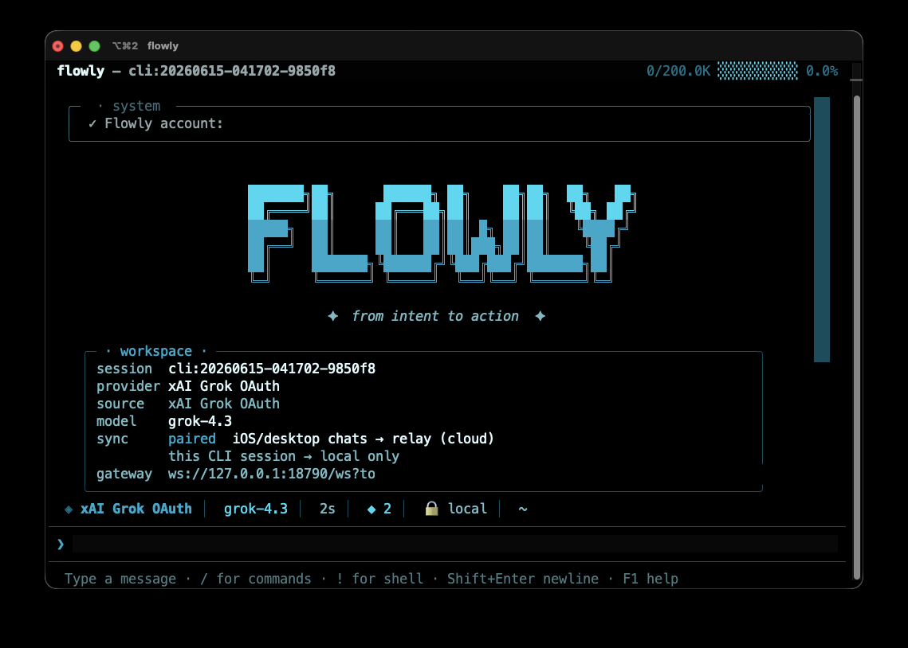
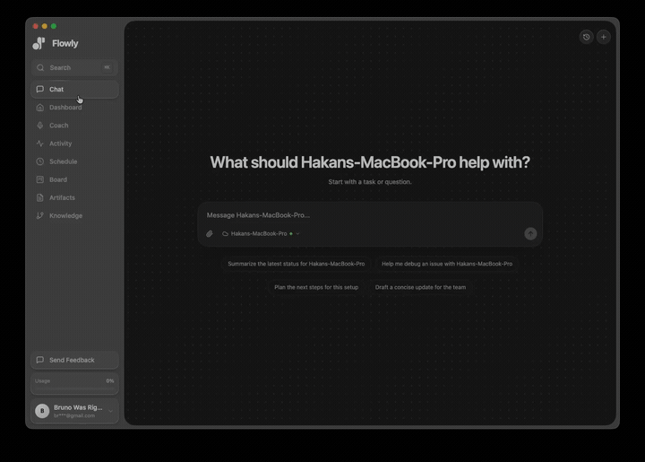
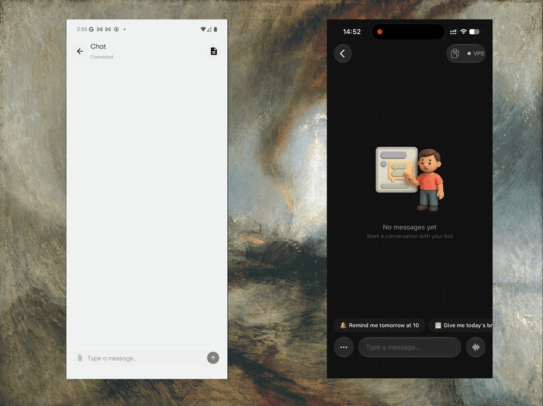
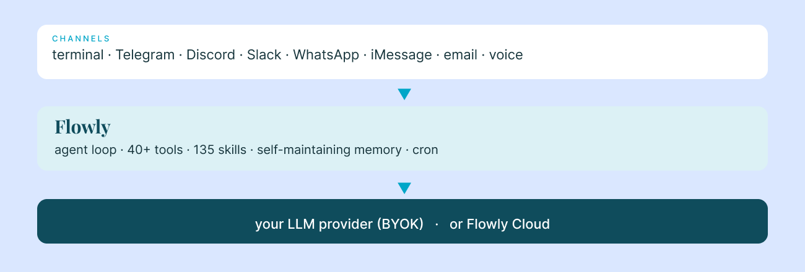
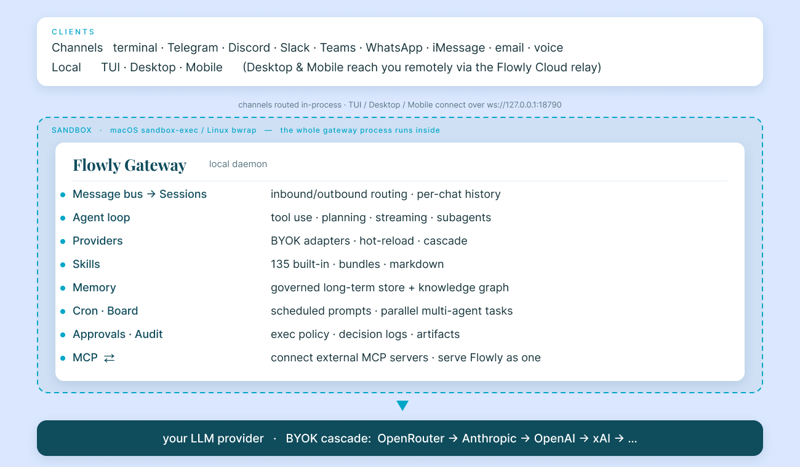

<div align="center">
  
  <p>
    <a href="https://pypi.org/project/flowly-ai/"></a>
    
    
    <a href="LICENSE"></a>
  </p>
</div>

**Flowly is an open-source AI agent that runs on _your_ machine, meets you on every channel you already use, and gets better the longer you use it.** One shared memory, one library of skills, your own LLM keys. It remembers across conversations, maintains and improves itself over time, schedules its own work, and connects to anything that speaks [MCP](MCP.md) — from a $5 VPS, a Mac mini, or the laptop in front of you.

<div align="center">
  
  <br><br>
  
  <br><br>
  
</div>

<div align="center">
  
</div>

---

## Quick start

```bash
# Install — one command sets up uv, Python, and Flowly
curl -fsSL https://useflowlyapp.com/install.sh | bash
# (already manage tools with uv? `uv tool install flowly-ai`)

# First-time setup — pick an LLM provider, add any channels
flowly setup

# Start chatting (bare `flowly` opens the terminal UI)
flowly
```

`flowly setup` walks you through a provider (OpenRouter, Anthropic, OpenAI, Gemini, Groq, xAI/Grok, Zhipu, or a local model) and any channels you want. Two minutes, done. Add a Telegram bot? `flowly setup` → Telegram → paste token. The gateway hot-reloads each channel as you save.

---

## What's inside

<table>
<tr>
  <td width="30%"><b>One agent, every channel</b></td>
  <td>Terminal TUI · Telegram · Discord · Slack · Microsoft Teams · WhatsApp · iMessage · Email · voice. A single gateway process speaks to all of them, with one conversation memory shared across every surface. Native Mac / iOS / Android apps and a browser extension come via <a href="https://useflowlyapp.com">Flowly Cloud</a> (optional).</td>
</tr>
<tr>
  <td><b>40+ first-class tools</b></td>
  <td>Workspace-sandboxed file I/O and an allowlisted shell with per-command approval; web search + page fetch + live X/Twitter; macOS computer-use (Accessibility control, screenshots, browser-tab + clipboard); PDF/DOCX/XLSX/PPTX, image generation, <code>video_analyze</code>; Linear, Trello, Home Assistant, and Google Workspace (Calendar, Contacts, Drive, Tasks).</td>
</tr>
<tr>
  <td><b>A closed learning loop</b></td>
  <td>Every fact you share becomes a <b>governed memory</b> with a calibrated trust score — 👍/👎 to retune it, and a background consolidation pass merges duplicates and retires stale notes. Structured facts also land in a <b>knowledge graph</b>. Opt in and Flowly mines your recurring procedures to <b>write and refine its own skills</b>, every change snapshotted and reversible. → <a href="docs/memory-governance-architecture.md">memory</a> · <a href="docs/skill-self-improvement-architecture.md">skills</a></td>
</tr>
<tr>
  <td><b>135 built-in skills</b></td>
  <td>Plus skill <b>bundles</b> (one keystroke enables a whole stack) and drop-in Markdown skills. Compatible with the open <a href="https://agentskills.io">agentskills.io</a> standard.</td>
</tr>
<tr>
  <td><b>Delegates and parallelizes</b></td>
  <td>Spawn isolated sub-agents for parallel workstreams (<code>delegate</code>, <code>spawn</code>), run a cross-channel <b>task board</b> sequentially or in parallel (<a href="BOARD.md">BOARD.md</a>), and hand heavy coding off to a local <b>Codex</b> session (opt-in).</td>
</tr>
<tr>
  <td><b>MCP, both directions</b></td>
  <td>Connect any <a href="MCP.md">MCP</a> server (<code>flowly mcp install …</code>) <i>and</i> run Flowly itself as an MCP server (<code>flowly mcp serve</code>) for Claude Desktop, Cursor, or Claude Code.</td>
</tr>
<tr>
  <td><b>Scheduled & unattended</b></td>
  <td>Built-in <b>cron</b> — schedule any natural-language prompt and deliver the result to any channel. Run the gateway as a background service that survives reboots.</td>
</tr>
<tr>
  <td><b>Yours to extend & contain</b></td>
  <td>Full Python <b>plugins</b> (tools, slash commands, channels, lifecycle hooks → <a href="PLUGINS.md">PLUGINS.md</a>), switchable <b>personas</b>, and a <b>sandbox</b> (macOS <code>sandbox-exec</code>, Linux <code>bwrap</code>; opt out with <code>FLOWLY_SANDBOX=0</code>).</td>
</tr>
</table>

---

## Providers — bring your own key

Adapters for **[OpenRouter](https://openrouter.ai), [Anthropic](https://www.anthropic.com), [OpenAI](https://openai.com), [Google Gemini](https://ai.google.dev), [Groq](https://groq.com), [xAI / Grok](https://x.ai), [Zhipu / GLM](https://z.ai)**, any **OpenAI-compatible local model** ([Ollama](https://ollama.com), [LM Studio](https://lmstudio.ai), [vLLM](https://github.com/vllm-project/vllm)), and a hosted **Flowly Cloud** option. Sign in to xAI with your **SuperGrok / X Premium+** subscription instead of an API key. Switch any time:

```bash
flowly                     # open the chat
/provider openrouter       # pick provider
/model anthropic/claude-sonnet-4-6
```

Or edit `~/.flowly/config.json`. When nothing is pinned, Flowly cascades through whatever you've configured (OpenRouter → Anthropic → OpenAI → xAI → …) so it always has a working model.

---

## CLI vs messaging — quick reference

Two entry points: start the terminal UI with `flowly`, or run the gateway and talk to Flowly from Telegram, Discord, Slack, WhatsApp, iMessage, or email. Once you're in a conversation, most slash commands work the same in both.

| Action | Terminal (TUI) | Messaging channels |
|---|---|---|
| Start chatting | `flowly` | `flowly setup` → add channel, then message the bot |
| New / reset conversation | `/new` | `/new` |
| Change model / provider | `/model`, `/provider` | `/model`, `/provider` |
| Switch persona | `/persona [name]` | `/persona [name]` |
| Browse & run skills | `/skills` or `/<skill>` | `/<skill>` |
| Inspect / correct memory | `/memory`, `flowly memory list` | `/memory` |
| Sessions & history | `/sessions` | `/sessions` |
| Interrupt current work | `Ctrl+C` or send a message | `/stop` or send a message |

---

## Self-host or cloud

Flowly's agent core is **Apache 2.0**. Self-host on your laptop, a VPS, or a Mac mini — your keys, your data, your machine. **Everything in this repo works with no Flowly account.** → [self-hosting guide](SELF_HOSTING.md) · [open source vs. Desktop/Cloud](DESKTOP_VS_OSS.md)

Optional [Flowly Cloud](https://useflowlyapp.com) adds the native Mac/iOS/Android apps, cross-device sync, hosted LLM access, and a managed relay that keeps your bot reachable when your laptop sleeps. Sign-in is opt-in (`flowly login`) and only affects the cloud features; the agent is unchanged.

---

## Common commands

```bash
flowly                         # terminal chat (TUI)
flowly setup                   # interactive wizard (LLM, channels, integrations)
flowly agent -m "..."          # one-shot prompt
flowly service install --start # run the gateway as a background service
flowly restart                 # smart restart (launchd / systemd / Task Scheduler)
flowly doctor                  # diagnose config + runtime health
flowly memory list             # inspect / correct long-term memory
flowly skill mine --dry-run    # preview self-improved skills (opt-in subsystem)
flowly mcp install <name>      # add an MCP server from the catalog
flowly mcp serve               # expose Flowly as an MCP server
flowly login / logout          # Flowly Cloud account (optional)
```

Other command groups: `flowly channels · cron · plugins · skills · bundles · persona · codex · xai · sessions · approvals · pairing`. Full reference: `flowly --help`.

---

## Architecture

<div align="center">
  
</div>

The gateway runs as a local daemon, and the **whole process runs inside the OS sandbox** (`sandbox-exec` on macOS, `bwrap` on Linux). Channels route through an in-process message bus; the TUI, desktop, and mobile apps connect as clients over one WebSocket protocol (`ws://127.0.0.1:18790`) — desktop and mobile can also reach it remotely via the Flowly Cloud relay. Config lives at `~/.flowly/config.json`, shared by every client. → [internal RPC protocol](docs/internal-gateway-rpc-architecture.md)

---

## Installation paths

| Method | Command | When |
|---|---|---|
| Install script | `curl -fsSL https://useflowlyapp.com/install.sh \| bash` | Recommended — sets up uv, Python, Flowly, PATH |
| `uv tool` | `uv tool install flowly-ai` | If you already manage tools with uv |
| Source | `git clone … && pip install -e ".[dev]"` | Contributors |

After install, run `flowly setup`. To run without a terminal session open:

```bash
flowly service install --start    # launchd (macOS) / systemd (Linux) / Task Scheduler (Windows)
```

It survives reboots and terminal close.

---

## Documentation

- [MCP.md](MCP.md) — connect external MCP servers + run Flowly as an MCP server
- [PLUGINS.md](PLUGINS.md) — extend Flowly with custom tools, hooks, commands, skills
- [BOARD.md](BOARD.md) — the cross-channel task board (sequential + parallel agents)
- [SECURITY.md](SECURITY.md) — trust model + vulnerability reporting
- [SELF_HOSTING.md](SELF_HOSTING.md) — run Flowly on your own machine or a VPS
- [DESKTOP_VS_OSS.md](DESKTOP_VS_OSS.md) — what's open source vs. Desktop & Cloud
- [CONTRIBUTING.md](CONTRIBUTING.md) — dev setup, project layout, PR process
- **Engineering deep-dives:** [memory governance](docs/memory-governance-architecture.md) · [skill self-improvement](docs/skill-self-improvement-architecture.md) · [internal gateway RPC](docs/internal-gateway-rpc-architecture.md)

---

## Community

- 🐛 [Issues](https://github.com/Nocetic/flowly/issues) — bugs and feature requests
- 🌐 [useflowlyapp.com](https://useflowlyapp.com) — apps, hosted cloud, and docs
- 📚 [agentskills.io](https://agentskills.io) — the open skills standard Flowly speaks

---

## Status

Flowly was open-source in v1.x, closed during the v2 rewrite, and is back open under **Apache 2.0**. The agent, 40+ tools, 135 skills, and every channel adapter in this repo are the same code that ships inside the Flowly Desktop app — there is no separate "lite" build.

Active development. Issues and PRs welcome.

---

## License

[Apache 2.0](LICENSE). Fork it, ship it, embed it. Self-hosted use with your own LLM keys is unrestricted. Commercial use of *Flowly Cloud* credentials (account / relay / gateway tokens) is governed by our [Acceptable Use Policy](https://useflowlyapp.com/terms#acceptable-use) — broadly: use them via official Flowly clients, not custom harnesses that proxy our subscription.

---

## Acknowledgments

Inspired by [Claude Code](https://github.com/anthropics/claude-code) (Anthropic) and the broader open-source agent community. Built by [Nocetic Limited](https://useflowlyapp.com).
